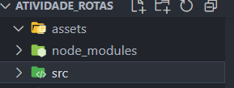
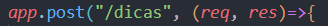
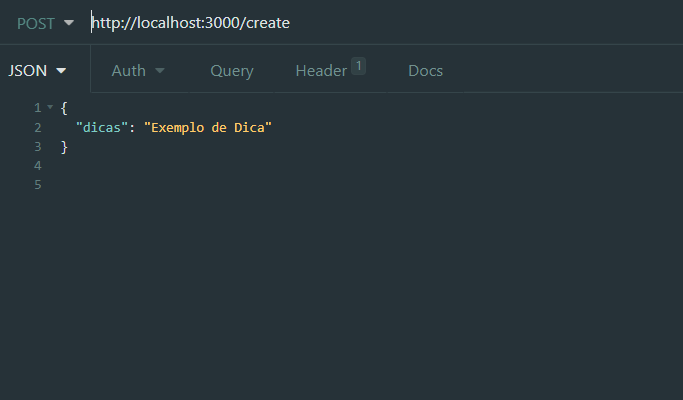
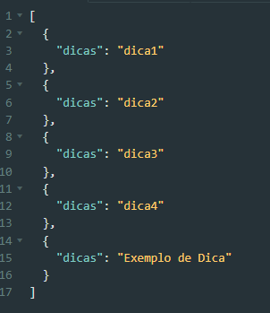
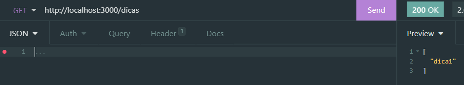

# Atividade_Rotas
Atividade SPRINT do módulo 04 do curso da Resilia Educação utilizando node.js e express afim de praticar a utilização de rotas, mvc e criação de API's.
A atividade consiste em criar uma lista de itens a partir do método POST, e ler qualquer dica da lista de forma aleatória através do método GET.

## 🚀 Começando

Essas instruções permitirão que você obtenha uma cópia do projeto em operação na sua máquina local para fins de teste.

Consulte **Executando a aplicação** para saber como utilizar o projeto.

### 📋 Pré-requisitos

O que você precisa para instalar o software e como instalá-lo?

```
Node.js Versão 16.15.1 (Que no momento é a versão LTS)
Express (Biblioteca utilizada no Node).
```

### 🔧 Instalação

Uma série de exemplos passo-a-passo que informam o que você deve executar para ter um ambiente de desenvolvimento em execução.

Instalação do Node:


***Windows:***

Você pode baixar direto pelo site: [node](https://nodejs.org/en/)

Ou então via Chocolatey:
```
choco install nodejs-lts
```

***Mac:***

Você pode baixar direto pelo site: [node](https://nodejs.org/en/)

***Linux*** 
via apt e snap:

```
sudo apt-get install curl
curl -fsSL https://deb.nodesource.com/setup_lts.x | sudo -E bash -
sudo apt-get install -y nodejs
```

Após a instalação do Node utilizaremos os comandos do NPM (Node Package Manager) no terminal para instalar a biblioteca Express:

```
npm i Express
```
Após a instalação você deve ter baixado uma pasta chamada node_modules conforme abaixo:

.

## ⚙️ Executando a aplicação

Para utilizar a aplicação, é necessário executar através de alguma ferramenta de software que é possível testar as rotas. Recomendamos
aqui a utilização do Insomnia (necessita de download) ou do Postman (que é utilizado online através de criação de conta no site).

* [Insomnia](https://insomnia.rest/download)

* [Postman](https://www.postman.com/)

Para executar o teste você deve inserir o comando start do npm:

```
npm start
```
O npm start começa a rodar a aplicação e retorna um servidor que deve ser copiado e colado na ferramenta escolhida:


## Método POST
Para executar a inserção dos itens da lista é necessário utilizar a rota do arquivo utilizada pelo script encontrado na pasta controllers:



Exemplo de como devem ser executado o método POST: 




Exemplo de como será executado o método GET, gerando um item da lista de forma aleatória:



## 🛠️ Construído com

Ferramentas utilizadas:

* [Express](https://expressjs.com/pt-br/)
* [Node](https://nodejs.org/en/docs/)
* [Insomnia](https://docs.insomnia.rest/)
* [Postman](https://www.postman.com/product/what-is-postman/)

## ✒️ Autores

Projeto desenvolvido em conjunto pelo Squad 1:

* [Rafael Jordão](https://github.com/rafaelljordao) - *Pair Programing* 
* [Fernando Patrick](https://github.com/FernandoPatrick) - *Code Review* 
* [Flávio Christovam](https://github.com/fchristovam) - *Documentação* 
* [João Paulo](https://github.com/Joao-P-G-Begiato) - *Pair Programming* 
* [Lucas Passos](https://github.com/LucasBinho) - *Programing* 


## 🎁 Agradecimentos

* Primeiro ao Leonardo Costa, nosso Facilitador Tech que nos engaja a sempre buscar novos conhecimentos e colocá-los em prática.
* Em segundo, à Anna Carolina Souza, Facilitadora Soft (que admitamos, é a base para tudo funcionar bem).
* À Resilia Educação, que criou essa comunidade incrível tornando tudo isso possível.
* E, claro, aos integrantes desse grupo sensacional!